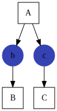
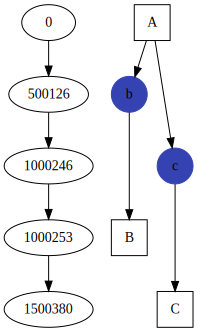
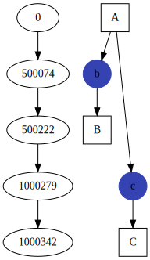
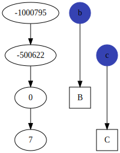

# Executable Node Graph

Imagine 3 processes, A, B and C. Process B takes resource b and performs some
additional computation. Process C takes resource c and does some computation.

A simple graph of the execution might look like this.



If process A is able to produce resource b first, we can schedule porcess B to
execute on a separate thread as soon as b is produced instead of waiting until
process A has been completed.

This library allows you to construct execution nodes and place them within a
graph. It will make the appropriate links and schedule nodes for execution as
they become available.

The above example can be seen in code here.

```C++
#include <iostream>
#include "node_graph.h"
#include "serial_executor.h"

class A
{
public:
    out_resource<int> b;
    out_resource<int> c;

    A( ResourceRegistry & G)
    {
        b = G.register_output_resource<int>("b");
        c = G.register_output_resource<int>("c");
    }
    void operator()()
    {
        b.emplace<int>(3);
        b.make_available(); // make b available to any nodes which has registered
        std::this_thread::sleep_for( std::chrono::milliseconds(500);
        c.emplace<int>(10);
        c.make_available();  // make c available to any nodes which has registered
    }
};

class B
{
public:
    in_resource<int> b;

    B( ResourceRegistry & G)
    {
        b = G.register_input_resource<int>("b");
    }
    void operator()()
    {
        std::cout << b.get() << std::endl;
    }
};

class C
{
public:
    in_resource<int> c;

    C( ResourceRegistry & G)
    {
        c = G.register_input_resource<int>("c");
    }
    void operator()()
    {
        std::cout << c.get() << std::endl;
    }
};
```

We can now set up the graph and then execute it serially.  The print() method
will print out the execution as a Diagraph.

```C++
int main()
{
  node_graph G;
  G.add_node<A>().set_name("A");
  G.add_node<B>().set_name("B");
  G.add_node<C>().set_name("C");

  serial_executor Exec(G);
  Exec.execute();
  G.print();
  return 0;
}

```

## Thread Pool Execution

The above code can be executed using a thread pool. The only thing you have to
do is provide a wrapper which allows it to schedule tasks. For example, using
gnl::thread_pool (provided), we simply have to overload the () operator to push
tasks on to the queue.

```
struct ThreadPoolWrapper
{
    ThreadPoolWrapper( gnl::thread_pool & T) : m_threadpool(&T)
    {
    }
    void operator()( std::function<void(void)> & exec)
    {
        m_threadpool->push(exec);
    }
    gnl::thread_pool *m_threadpool;
};

int main()
{
    node_graph G;
    G.add_node<A>().set_name("A");
    G.add_node<B>().set_name("B");
    G.add_node<C>().set_name("C");

    gnl::thread_pool T(4);   // create the threadpool with 4 workers
    ThreadPoolWrapper TW(T); // create the wrapper.

    threaded_executor<ThreadPoolWrapper> Exec(G); // create the executor
    Exec.set_thread_pool(&TW); // set the threadpool wrapper

    Exec.execute(); // execute
    Exec.wait();    // wait for the threads to finish

    G.print();
    return 0;
}


```


# Examples

## Example 1: Serial Execution

Simple serial execution of 3 nodes. In this example Node A produces resources b
after 500ms and resource c andfer 1000ms. Executing in serial mode shows that
nodes A, B and C all execute roughly 500ms apart since a single thread can only
execute one node at a time.




## Example 2: Threadpool

Example 2 takes example 1 and executes the graph using a Thread Pool. In this case
node B was able to execute as soon as resource b was available and C was able
to execute as soon as resource c was available



## Example 3: One-Shot node and Permanent Resources

A One-Shot node is executed only once and then removed from the graph. A
One-Shot node can only produce Permanent resources. A permanent resource is a
resource that will not be reset when reset() is called and continues to exist
until the Graph is destroyed.

In this example we set up node A to be a one-shot node, producing permanent
resources b and c. Once we execute the graph once, Node A is no longer needed
and is deleted. On the second run, we see that Node A is not executed.

On the first execution, the graph looks similar to Example 2.


But on the second execution you can see that both B and C execute almost instantly
since both resources are still available.


